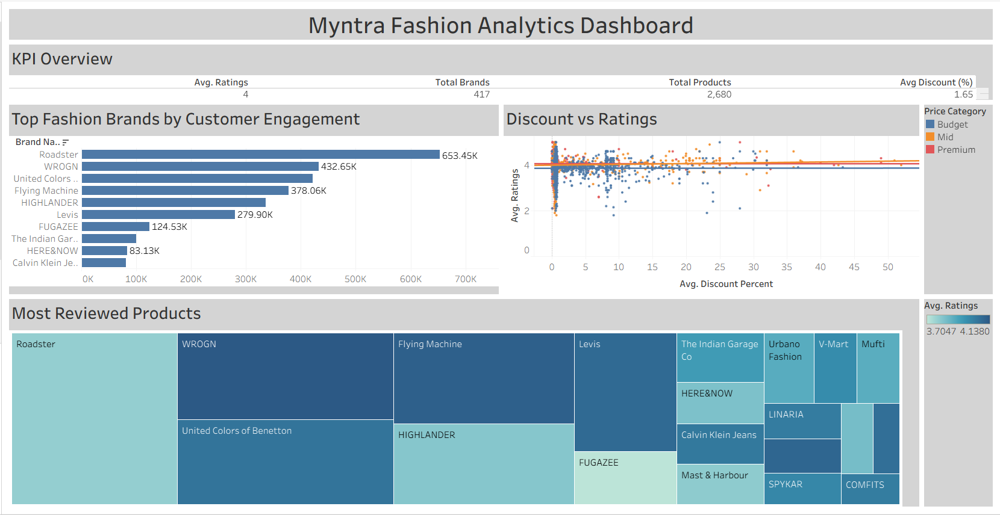
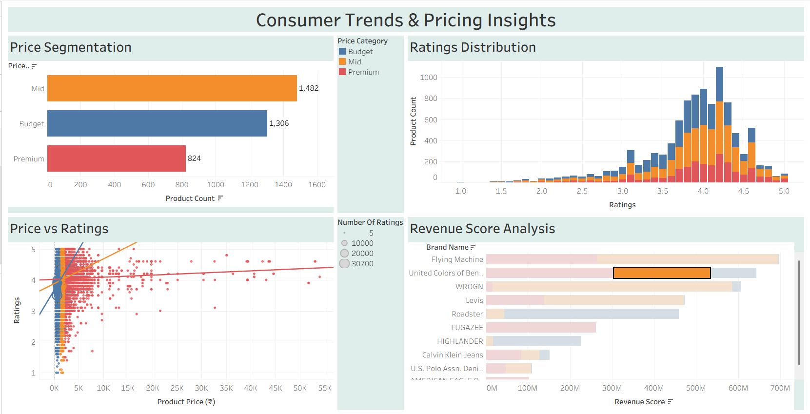
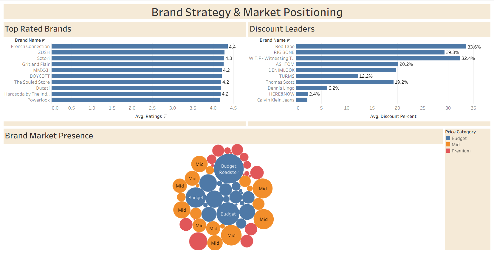

# Myntra Fashion Analytics Dashboard

## 📌 Project Overview
This Tableau project analyzes Myntra fashion product data to understand:

- Customer ratings
- Brand performance
- Discount strategies
- Revenue insights
- Price segmentation
- Market presence

---

## 📊 Dashboards

### 1. Executive KPI Dashboard
- Average ratings
- Total products
- Brand engagement
- Discount analysis

### 2. Consumer Trends & Pricing Insights
- Ratings distribution
- Price segmentation
- Revenue analysis
- Price vs ratings

### 3. Brand Strategy Dashboard
- Top rated brands
- Discount leaders
- Brand market presence

---

## 🛠 Tools Used
- Tableau Public
- CSV Dataset
- Data Visualization
- Business Analytics

---

## 📷 Dashboard Preview

### Dashboard 1

### Dashboard 2

### Dashboard 3

---

## 📁 Files Included
- Tableau Workbook (.twbx)
- Dataset (.csv)
- Dashboard Screenshots

---

## 📈 Key Insights
- Budget brands dominate product volume.
- Higher discounts do not always improve ratings.
- Mid-price brands show strong customer engagement.
- Some premium brands maintain high ratings with lower discounts.
